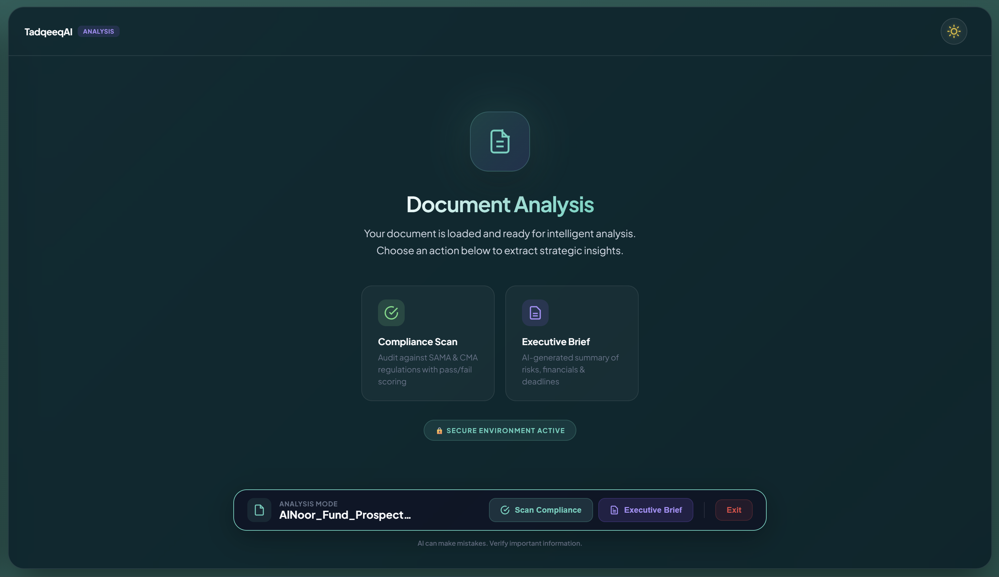
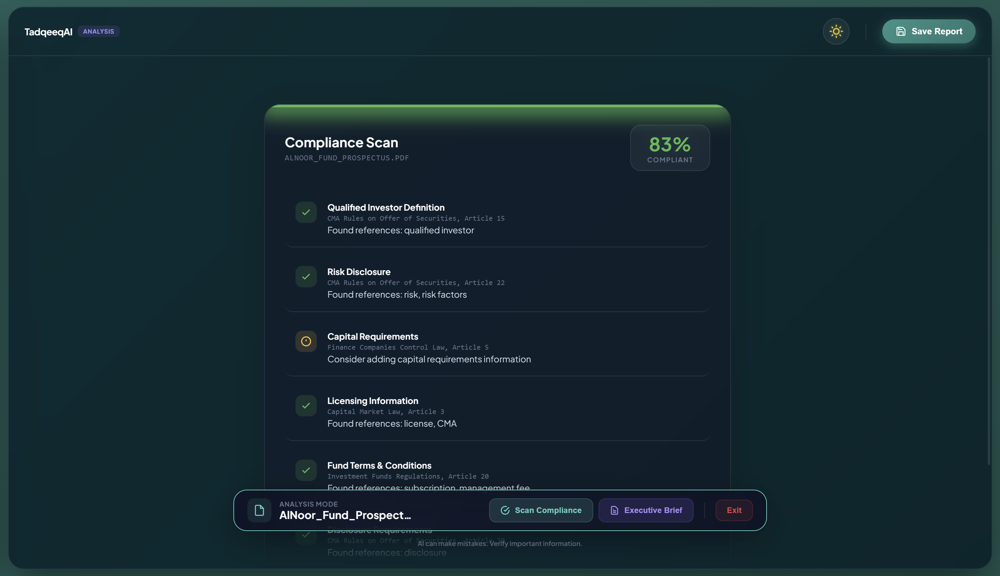
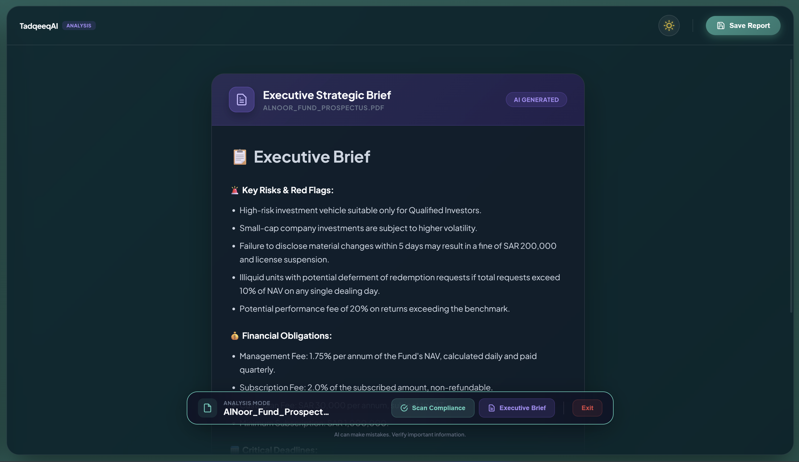

# TadqeeqAI 🏛️

### AI-Powered Bilingual Islamic Finance Regulatory Compliance Assistant

A sophisticated Retrieval-Augmented Generation (RAG) desktop application that provides accurate, citation-backed answers to regulatory compliance questions for Saudi Arabian Islamic finance laws in **both English and Arabic**.

<p align="center">
  
</p>

---

## 🎯 What is TadqeeqAI?

**TadqeeqAI** (تدقيق - Arabic for "verification/auditing") is a locally-running AI assistant designed for financial professionals, compliance officers, legal teams, and researchers working with Saudi Arabian financial regulations.

The app indexes **1,350+ regulatory articles** from SAMA (Saudi Central Bank) and CMA (Capital Market Authority) documents, enabling instant, accurate answers with full citations—all while keeping your data completely private on your machine.

---

## ✨ Key Features

### 💬 Intelligent Chat Interface
| Feature | Description |
|---------|-------------|
| 🌐 **Bilingual Support** | Query in English or Arabic — responses match your language |
| 🔍 **Hybrid Search** | BM25 keyword + Semantic vector search with Reciprocal Rank Fusion |
| 📊 **Dual Regulators** | Covers both SAMA and CMA regulations (1,350+ articles) |
| 🎯 **Smart Routing** | Auto-detects which regulator's documents to search |
| 💾 **Chat History** | Persistent conversations with rename/delete functionality |
| 📤 **Export Options** | Save chats as Markdown (.md) or PDF (.pdf) |

### 📄 Document Analysis Mode
| Feature | Description |
|---------|-------------|
| 📎 **File Upload** | Drag & drop or click to upload PDF/DOCX documents |
| ✅ **Compliance Scanner** | Automated audit against 6 regulatory categories |
| 📋 **Executive Brief** | AI-generated strategic summary with risks & deadlines |
| 💾 **Report Export** | Save compliance reports and briefs as PDFs |

### 🎨 Modern UI/UX
| Feature | Description |
|---------|-------------|
| 🌙 **Dark/Light Themes** | Beautiful glassmorphic design in both modes |
| ⚡ **Smooth Animations** | Polished transitions and micro-interactions |
| 📱 **Responsive Layout** | Collapsible sidebar with fluid resizing |
| ⌨️ **Keyboard Shortcuts** | Ctrl+N (new chat), Ctrl+/ (focus input), Escape (collapse sidebar) |

---

## 🖼️ Screenshots

### Chat Interface - English Query
<p align="center">
  
</p>

### Chat Interface - Arabic Query (RTL Support)
<p align="center">
  
</p>

### Analysis Mode - Document Loaded
<p align="center">
  
</p>

### Compliance Scan Results
<p align="center">
  
</p>

### Executive Brief Report
<p align="center">
  
</p>

---

## 🚀 Quick Start

### Prerequisites
- **Python 3.12+**
- **[Ollama](https://ollama.com/)** installed and running
- **8GB+ RAM** recommended

### Installation

```bash
# Clone the repository
git clone https://github.com/M-AlAteegi/TadqeeqAI.git
cd TadqeeqAI

# Install dependencies
pip install -r requirements.txt

# Download the LLM (Aya 8B - bilingual Arabic/English)
ollama pull aya:8b

# Run the application
python app.py
```

### First Launch
On first run, TadqeeqAI will:
1. Load the vector database (~10 seconds)
2. Initialize BM25 search index
3. Verify Ollama connection
4. Display the welcome screen when ready

---

## 🗂️ Document Coverage

### SAMA Documents (Saudi Central Bank)
| Document | Status |
|----------|--------|
| Finance Companies Control Law | ✅ EN/AR |
| Implementing Regulation of Finance Companies | ✅ EN/AR |
| Real Estate Finance Law | ✅ EN/AR |
| Implementing Regulation of Real Estate Finance | ✅ EN/AR |

### CMA Documents (Capital Market Authority)
| Document | Status |
|----------|--------|
| Capital Market Law | ✅ EN/AR |
| Capital Market Institutions Regulations | ✅ EN/AR |
| Investment Funds Regulations | ✅ EN/AR |
| Merger and Acquisition Regulations | ✅ EN/AR |
| Rules on Offer of Securities | ✅ EN/AR |
| Glossary of Defined Terms | ✅ EN/AR |
| Law of Systemically Important Financial Institutions | ✅ EN/AR |

**📊 Total: 1,350+ indexed articles across 22 documents (11 EN + 11 AR)**

---

## 📄 Document Analysis Mode

### How to Use

1. **Upload a Document**
   - Click the 📎 attach button in the input bar, OR
   - Drag & drop a PDF/DOCX file onto the app

2. **Enter Analysis Mode**
   - The app switches to Analysis Mode automatically
   - Your document name appears in the control bar

3. **Choose an Action**
   - **Scan Compliance**: Run automated regulatory audit
   - **Executive Brief**: Generate AI strategic summary

4. **Export Results**
   - Click "Save Report" to download as PDF

### Compliance Categories Scanned
| Category | What It Checks |
|----------|----------------|
| 📜 Capital Requirements | Minimum capital, reserve ratios |
| 📋 Licensing & Registration | Proper authorizations |
| 📢 Disclosure Requirements | Transparency obligations |
| ⚖️ Governance & Risk | Board structure, risk management |
| 🔒 AML/KYC Compliance | Anti-money laundering measures |
| ☪️ Sharia Compliance | Islamic finance principles |

---

## 🛠️ Tech Stack

| Component | Technology |
|-----------|------------|
| **LLM** | Aya 8B via Ollama (bilingual AR/EN) |
| **Embeddings** | intfloat/multilingual-e5-base |
| **Vector Database** | ChromaDB |
| **Keyword Search** | BM25 (rank_bm25) |
| **Desktop Framework** | PyWebView |
| **PDF Processing** | PyMuPDF (fitz) |
| **DOCX Processing** | python-docx |
| **PDF Generation** | ReportLab |

---

## 💡 Example Queries

### English
```
What are the licensing fees for finance companies?
What is a qualified investor under CMA regulations?
What are the requirements for sukuk issuance?
Explain the governance requirements for investment funds.
```

### Arabic
```
ما هي رسوم ترخيص شركات التمويل؟
ما هو المستثمر المؤهل؟
ما هي متطلبات إصدار الصكوك؟
اشرح متطلبات الحوكمة لصناديق الاستثمار
```

### Follow-up Queries
After any response, you can ask:
- "Simplify this" / "وضح أكثر"
- "Give me an example"
- "What about penalties for non-compliance?"

---

## 📁 Project Structure

```
TadqeeqAI/
├── app.py               # Application entry point
├── backend.py           # Core logic (RAG, search, analysis)
├── ui.py                # PyWebView UI (HTML/CSS/JS)
├── requirements.txt     # Python dependencies
├── bm25_index.pkl       # BM25 search index
├── documents.json       # Document metadata
├── LICENSE              # MIT License
├── README.md            # This file
├── RELEASE_NOTES.md     # Version history
│
├── chroma_db_v2/        # Vector database
├── chat_history/        # Saved conversations (JSON)
├── images/              # Screenshots
└── samples/             # Sample documents for testing
```

---

## ⌨️ Keyboard Shortcuts

| Shortcut | Action |
|----------|--------|
| `Ctrl + N` | New Chat |
| `Ctrl + /` | Focus Input |
| `Escape` | Collapse Sidebar |
| `Enter` | Send Message |
| `Shift + Enter` | New Line in Input |

---

## 🔒 Privacy & Security

- **100% Local Processing**: All data stays on your machine
- **No Cloud Dependencies**: Works offline after initial setup
- **No Telemetry**: Zero data collection or tracking
- **Your Documents Stay Private**: Uploaded files are processed locally and can be cleared

---

## 🐛 Troubleshooting

### Ollama Not Found
```bash
# Ensure Ollama is installed and running
ollama serve

# Verify Aya model is downloaded
ollama list
```

### Slow First Response
The first query may take 10-15 seconds as Ollama loads the model into memory. Subsequent queries are much faster.

### High Memory Usage
Aya 8B requires ~6GB RAM. Close other applications if you experience slowdowns.

---

## 🗺️ Roadmap

- [ ] Additional regulator documents (SADAD, Mada)
- [ ] Multi-document comparison analysis
- [ ] Citation linking to original PDFs
- [ ] Advanced search filters (by regulator, date, category)
- [ ] API mode for integration with other tools

---

## 👤 Author

**Mohammed Alateegi**  
AI Graduate | Data Science & Machine Learning Specialist

[](https://www.linkedin.com/in/mohammed-alateegi-2853b3248/)
[](mailto:m7mdateegi@gmail.com)
[](https://github.com/M-AlAteegi)

---

## 📄 License

This project is licensed under the MIT License - see the [LICENSE](LICENSE) file for details.

---

<p align="center">
  <b>Built with ❤️ for Islamic Finance Compliance in Saudi Arabia</b>
  <br><br>
  
  
  
</p>
