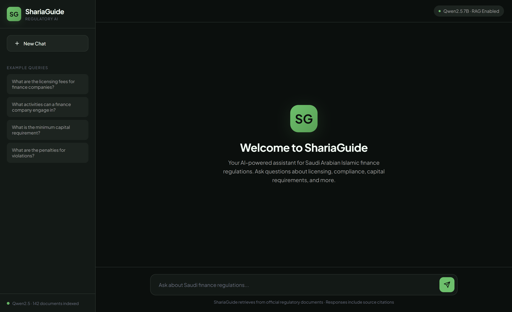
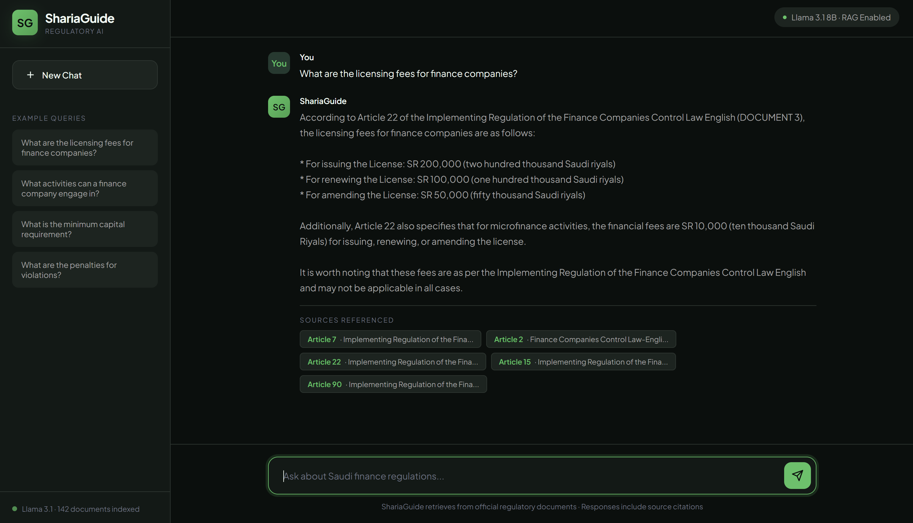
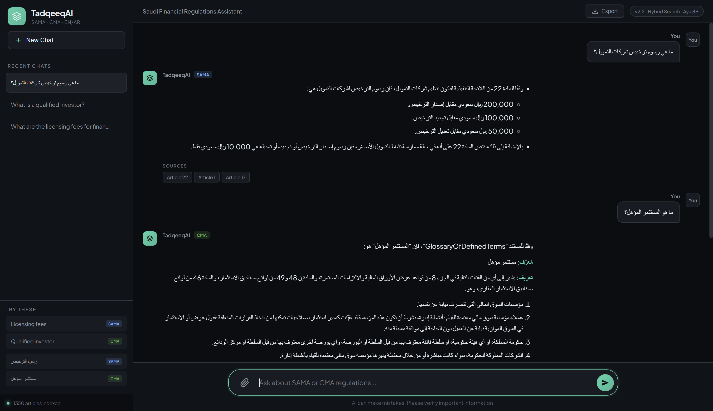

# TadqeeqAI 🏛️

### AI-Powered Bilingual Islamic Finance Regulatory Compliance Assistant

A Retrieval-Augmented Generation (RAG) system that provides accurate, citation-backed answers to regulatory compliance questions for Saudi Arabian Islamic finance laws in **both English and Arabic**.

<p align="center">
  
</p>

---

## 📋 Version History

| Version | Key Changes | Model |
|---------|-------------|-------|
| **v2.0** (Current) | Bilingual EN/AR, Hybrid Search, New UI | Aya 8B |
| v1.2 | Qwen 2.5 7B upgrade | Qwen 2.5 7B |
| v1.1 | Optimized retrieval | Llama 3.1 8B |
| v1.0 | Initial release | Llama 3.1 8B |

### What's New in v2.0

- **🌍 Bilingual Support**: Full Arabic and English query support
- **🔍 Hybrid Search**: BM25 (keyword) + Semantic search with RRF fusion
- **📚 Dual Regulator Coverage**: SAMA + CMA documents (1,350+ articles)
- **🎯 Smart Routing**: Automatic regulator detection based on query content
- **🖥️ Redesigned UI**: Modern dark theme with RTL Arabic support
- **🤖 New LLM**: Aya 8B - optimized for multilingual responses

### Why Aya 8B?

After extensive testing with Arabic queries, Aya 8B emerged as the best choice:

| Model | Arabic Quality | Response Quality | Issue |
|-------|----------------|------------------|-------|
| Qwen 2.5 7B | ⚠️ Medium | Good | Chinese character leak on long responses |
| Llama 3.1 8B | ❌ Poor | Excellent | Bad Arabic generation |
| Jais 13B | ✅ Excellent | Poor | Truncates responses |
| **Aya 8B** | ✅ **Excellent** | **Good** | **None** |

---

## 🎯 The Problem

Financial institutions in Saudi Arabia face significant challenges:
- **Dual Language Requirements**: Regulations exist in both Arabic and English
- **Information Overload**: Thousands of pages across SAMA and CMA regulations
- **Risk of Hallucination**: Standard AI chatbots fabricate answers
- **Compliance Risk**: Incorrect regulatory guidance can lead to penalties

## 💡 The Solution

TadqeeqAI is a **grounded AI assistant** that:
1. **Searches** both Arabic and English regulatory documents using hybrid search
2. **Retrieves** relevant articles with high precision
3. **Generates** answers based ONLY on retrieved documents
4. **Cites** specific articles for every claim - enabling verification
5. **Responds** in the same language as your query

> Unlike ChatGPT, TadqeeqAI cannot hallucinate. It only answers from your regulatory documents.

---

## ✨ Features

| Feature | Description |
|---------|-------------|
| 🌍 **Bilingual** | Query in English or Arabic - get responses in the same language |
| 🔍 **Hybrid Search** | BM25 + Semantic search with Reciprocal Rank Fusion |
| 📊 **Dual Regulators** | SAMA (finance companies) + CMA (capital markets) coverage |
| 📄 **Source Citations** | Every answer references specific Articles and documents |
| 🎯 **Smart Detection** | Automatically routes queries to relevant regulator |
| 🖥️ **Desktop App** | Native experience with modern dark UI |
| 🔒 **Fully Local** | All data stays on your machine - no cloud APIs |

---

## 🖼️ Screenshots

### English Query Response
<p align="center">
  
</p>

### Arabic Query Response (RTL Support)
<p align="center">
  
</p>

---

## 🗂️ Document Coverage

### SAMA Documents (4 Laws)
| Document | Articles EN | Articles AR |
|----------|-------------|-------------|
| Finance Companies Control Law | ✅ | ✅ |
| Implementing Regulation of Finance Companies | ✅ | ✅ |
| Real Estate Finance Law | ✅ | ✅ |
| Implementing Regulation of Real Estate Finance | ✅ | ✅ |

### CMA Documents (7 Regulations)
| Document | Articles EN | Articles AR |
|----------|-------------|-------------|
| Capital Market Law | ✅ | ✅ |
| Capital Market Institutions Regulations | ✅ | ✅ |
| Investment Funds Regulations | ✅ | ✅ |
| Merger and Acquisition Regulations | ✅ | ✅ |
| Rules on Offer of Securities | ✅ | ✅ |
| Glossary of Defined Terms | ✅ | ✅ |
| Law of Systemically Important Financial Institutions | ✅ | ✅ |

**Total: 1,350+ indexed articles across 22 documents**

---

## 🏗️ Architecture

```
┌─────────────────────────────────────────────────────────────────┐
│                         USER QUERY                               │
│     "What are the licensing fees?" / "ما هي رسوم الترخيص؟"      │
└─────────────────────────────┬───────────────────────────────────┘
                              │
                              ▼
┌─────────────────────────────────────────────────────────────────┐
│                    LANGUAGE DETECTION                            │
│              Arabic (>30% Arabic chars) → 'ar'                  │
│              Otherwise → 'en'                                    │
└─────────────────────────────┬───────────────────────────────────┘
                              │
                              ▼
┌─────────────────────────────────────────────────────────────────┐
│                   REGULATOR DETECTION                            │
│         Keywords → SAMA / CMA / BOTH                            │
└─────────────────────────────┬───────────────────────────────────┘
                              │
                              ▼
┌─────────────────────────────────────────────────────────────────┐
│                     HYBRID SEARCH                                │
│  ┌─────────────────┐         ┌─────────────────┐                │
│  │   BM25 Search   │         │ Semantic Search │                │
│  │   (Keywords)    │         │  (Embeddings)   │                │
│  └────────┬────────┘         └────────┬────────┘                │
│           │                           │                          │
│           └───────────┬───────────────┘                          │
│                       ▼                                          │
│              Reciprocal Rank Fusion                              │
│                  Top 5 Results                                   │
└─────────────────────────────┬───────────────────────────────────┘
                              │
                              ▼
┌─────────────────────────────────────────────────────────────────┐
│                    LOCAL LLM (Aya 8B)                           │
│            Generates answer from retrieved context              │
│            Responds in query language (EN/AR)                   │
└─────────────────────────────┬───────────────────────────────────┘
                              │
                              ▼
┌─────────────────────────────────────────────────────────────────┐
│                    CITED RESPONSE                                │
│     "According to Article 22, the licensing fees are..."        │
│     "وفقاً للمادة 22، رسوم الترخيص هي..."                       │
└─────────────────────────────────────────────────────────────────┘
```

---

## 🛠️ Tech Stack

| Component | Technology |
|-----------|------------|
| **Embeddings** | intfloat/multilingual-e5-base (278M params) |
| **Vector Database** | ChromaDB |
| **Keyword Search** | BM25 (rank_bm25) |
| **LLM** | Aya 8B via Ollama |
| **Desktop UI** | PyWebView |
| **Language** | Python 3.12+ |

---

## 📊 Performance

| Metric | v1.2 | v2.0 |
|--------|------|------|
| Documents Indexed | 142 | **1,350+** |
| Languages | English only | **English + Arabic** |
| Regulators | SAMA only | **SAMA + CMA** |
| Search Method | Semantic only | **Hybrid (BM25 + Semantic)** |
| Arabic Support | ❌ | ✅ |

---

## 🚀 Quick Start

### Prerequisites
- Python 3.12+
- [Ollama](https://ollama.com/) installed
- 8GB+ RAM recommended
- GPU recommended (but not required)

### Installation

```bash
# Clone the repository
git clone https://github.com/M-AlAteegi/TadqeeqAI.git
cd TadqeeqAI

# Install dependencies
pip install -r requirements.txt

# Download the LLM
ollama pull aya:8b

# Run the application
python main.py
```

### Requirements

```
sentence-transformers
chromadb
rank-bm25
pywebview
ollama
numpy
```

---

## 📁 Project Structure

```
TadqeeqAI/
├── main.py                  # Main desktop application
├── requirements.txt         # Python dependencies
├── LICENSE                  # MIT License
├── README.md               # This file
├── RELEASE_NOTES.md        # Version history
├── chroma_db_v2/           # Vector database (pre-built)
├── bm25_index.pkl          # BM25 index (pre-built)
├── documents.json          # Document metadata
└── images/                 # Screenshots
    ├── welcome_screen.png
    ├── query_response.png
    └── query_response_ar.png
```

---

## 💡 Example Queries

### English
- "What are the licensing fees for finance companies?"
- "What is a qualified investor?"
- "What are the requirements for sukuk issuance?"
- "What are the capital requirements for finance companies?"

### Arabic
- "ما هي رسوم ترخيص شركات التمويل؟"
- "ما هو المستثمر المؤهل؟"
- "ما هي متطلبات إصدار الصكوك؟"
- "ما هي متطلبات رأس المال لشركات التمويل؟"

---

## 🔮 Future Enhancements

- [ ] Conversation memory
- [ ] Export answers to PDF reports
- [ ] Additional regulator coverage
- [ ] Cloud deployment option
- [ ] API endpoint for integration

---

## 👤 Author

**Mohammed Alateegi**

AI Graduate | Data Science Specialist

[](https://www.linkedin.com/in/mohammed-alateegi-2853b3248/)
[](mailto:m7mdateegi@gmail.com)

---

## 📄 License

This project is licensed under the MIT License - see the [LICENSE](LICENSE) file for details.

---

## 🙏 Acknowledgments

- Saudi Arabian Monetary Authority (SAMA) for regulatory documentation
- Capital Market Authority (CMA) for regulatory documentation
- Cohere for Aya multilingual model
- The open-source community for the incredible tools

---

<p align="center">
  <b>Built with ❤️ for Islamic Finance Compliance</b>
</p>
