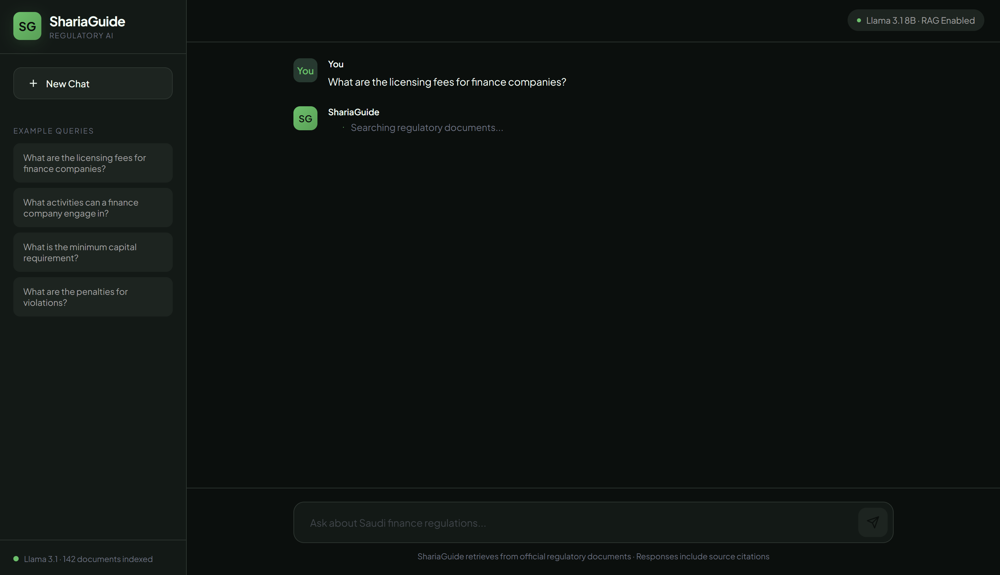

# ShariaGuide 🏛️

### AI-Powered Islamic Finance Regulatory Compliance Assistant

A Retrieval-Augmented Generation (RAG) system that provides accurate, citation-backed answers to regulatory compliance questions for Saudi Arabian Islamic finance laws.

<p align="center">
  
</p>

---

## 📋 Version History

| Version | Changes | Performance |
|---------|---------|-------------|
| **v1.2** (Current) | Upgraded to Qwen 2.5 7B model | **20s → 13s** (35% faster) |
| v1.1 | Optimized retrieval from 5 → 3 articles | 70s → 20s (71% faster) |
| v1.0 | Initial release | ~70s response time |

### What's New in v1.2

- **Model Upgrade**: Switched from Llama 3.1 8B to Qwen 2.5 7B
- **Faster Responses**: Query time reduced from ~20s to ~13s (35% improvement)
- **Better Formatting**: Cleaner numbered lists and structured output
- **Improved Citations**: More precise article references
- **Cumulative Improvement**: From v1.0 to v1.2, response time improved by **81%** (70s → 13s)

### Why Qwen 2.5 7B?

After benchmarking multiple models (Llama 3.1, Mistral, Gemma 2, Qwen 2.5), Qwen 2.5 7B emerged as the best choice:

| Model | Response Time | Accuracy | Formatting |
|-------|---------------|----------|------------|
| Llama 3.1 8B | 20s | ✅ Complete | Good |
| Mistral 7B | 20s | ✅ Complete | Good |
| Gemma 2 9B | 30s | ⚠️ Missed details | Good |
| **Qwen 2.5 7B** | **13s** | ✅ Complete | **Excellent** |

---

## 🎯 The Problem

Financial institutions in Saudi Arabia face a dual challenge:
- **Information Overload**: Compliance officers spend 30-40% of their time manually searching through thousands of pages of SAMA regulations and AAOIFI standards
- **Risk of Hallucination**: Standard AI chatbots fabricate answers, creating compliance and legal risks
- **Knowledge Silos**: Critical regulatory knowledge is scattered across multiple PDF documents

## 💡 The Solution

ShariaGuide is a **grounded AI assistant** that:
1. **Retrieves** relevant regulatory articles using semantic search
2. **Generates** answers based ONLY on retrieved documents
3. **Cites** specific articles for every claim - enabling verification

> Unlike ChatGPT, ShariaGuide cannot hallucinate. It only answers from your regulatory documents.

---

## ✨ Features

| Feature | Description |
|---------|-------------|
| 🔍 **Semantic Search** | Finds relevant articles by meaning, not just keywords |
| 📄 **Source Citations** | Every answer references specific Articles and documents |
| 🖥️ **Desktop Application** | Native app experience - no browser needed |
| 🔒 **Fully Local** | All data stays on your machine - no cloud APIs required |
| ⚡ **Fast Retrieval** | Vector embeddings enable sub-second document search |

---

## 🖼️ Screenshots

### Query in Progress
<p align="center">
  
</p>

### Response with Citations
<p align="center">
  
</p>

---

## 🏗️ Architecture

```
┌─────────────────────────────────────────────────────────────────┐
│                         USER QUERY                               │
│                "What are the licensing fees?"                    │
└─────────────────────────┬───────────────────────────────────────┘
                          │
                          ▼
┌─────────────────────────────────────────────────────────────────┐
│                    EMBEDDING MODEL                               │
│              (all-MiniLM-L6-v2 - 384 dims)                      │
│                   Query → Vector                                 │
└─────────────────────────┬───────────────────────────────────────┘
                          │
                          ▼
┌─────────────────────────────────────────────────────────────────┐
│                      VECTOR DATABASE                             │
│                       (ChromaDB)                                 │
│         Semantic search → Top 3 relevant articles               │
└─────────────────────────┬───────────────────────────────────────┘
                          │
                          ▼
┌─────────────────────────────────────────────────────────────────┐
│                    PROMPT CONSTRUCTION                           │
│        Retrieved Articles + Question + Instructions             │
└─────────────────────────┬───────────────────────────────────────┘
                          │
                          ▼
┌─────────────────────────────────────────────────────────────────┐
│                   LOCAL LLM (Qwen 2.5 7B)                       │
│            Generates answer from retrieved context              │
└─────────────────────────┬───────────────────────────────────────┘
                          │
                          ▼
┌─────────────────────────────────────────────────────────────────┐
│                    CITED RESPONSE                                │
│     "According to Article 22, the licensing fees are..."        │
└─────────────────────────────────────────────────────────────────┘
```

---

## 🛠️ Tech Stack

| Component | Technology |
|-----------|------------|
| **PDF Processing** | PyMuPDF (fitz) |
| **Embeddings** | Sentence-Transformers (all-MiniLM-L6-v2) |
| **Vector Database** | ChromaDB |
| **LLM** | Qwen 2.5 7B via Ollama |
| **Desktop UI** | PyWebView |
| **Language** | Python 3.12+ |

---

## 📊 Performance

| Metric | v1.0 | v1.1 | v1.2 |
|--------|------|------|------|
| Documents Indexed | 142 | 142 | 142 |
| Articles Retrieved | 5 | 3 | 3 |
| Average Query Time | ~70s | ~20s | **~13s** |
| Model | Llama 3.1 8B | Llama 3.1 8B | **Qwen 2.5 7B** |
| Output Quality | Good | Good | **Excellent** |

---

## 🚀 Quick Start

### Prerequisites
- Python 3.12+
- [Ollama](https://ollama.com/) installed
- 8GB+ RAM recommended

### Installation

```bash
# Clone the repository
git clone https://github.com/M-AlAteegi/ShariaGuide.git
cd ShariaGuide

# Install dependencies
pip install sentence-transformers chromadb pywebview requests pymupdf

# Download the LLM
ollama pull qwen2.5:7b

# Run the application
python ShariaGuide.py
```

---

## 📁 Project Structure

```
ShariaGuide/
├── ShariaGuide.py           # Main desktop application
├── create_embeddings.py     # Vector database builder
├── chunk_english_only.py    # PDF processing pipeline
├── knowledge_base_english.json
├── chroma_db/               # Vector database
├── raw_pdfs/                # Source regulatory documents
├── images/                  # Screenshots
└── README.md
```

---

## 🔮 Future Enhancements

- [ ] Arabic language support (requires OCR integration)
- [ ] Multi-document upload via UI
- [ ] Conversation memory
- [ ] Export answers to PDF reports
- [ ] Cloud deployment option

---

## 👤 Author

**Mohammed Alateegi**

AI Graduate | Data Science Specialist

[](https://www.linkedin.com/in/mohammed-alateegi-2853b3248/)
[](mailto:m7mdateegi@gmail.com)

---

## 📄 License

This project is licensed under the MIT License - see the [LICENSE](LICENSE) file for details.

---

## 🙏 Acknowledgments

- Saudi Arabian Monetary Authority (SAMA) for regulatory documentation
- Alibaba Cloud for Qwen 2.5
- The open-source community for the incredible tools that made this possible

---

<p align="center">
  <b>Built with ❤️ for Islamic Finance Compliance</b>
</p>
